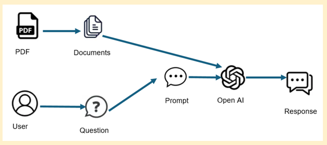

# Finanical Assistant (chat with pdf)

## Scope

The ‘ApGENie’ application should be able to assist users process PDF documents 
related to various loan types such as housing loans, education loans, vehicle loans, and 
medical loans.

# Functional Requirements 

1. PDF Input Handling 
2. Text Preprocessing  
3. Chunking Strategies  
4. Embedding Models 
5. Query Processing
6. Re-Ranking
7. Response Generation
8. User Interface

# User Guide

Step 1: [Visit the application](https://ap-genie.koyeb.app/).

Step 2: [User Interface and upload file](./Screenshots/chatbot-interface.PNG).

Step 3: [After uploading of file you will see a conformation message](./Screenshots/file-processing.PNG).

Step 4: [If answer is available in the given contect, you will see a response message.](./Screenshots/response.PNG).

Step 4: [If answer is not available in the given contect, you will see this response message.](./Screenshots/not-response.PNG).

Step 5: [You can also see/manage history.](./Screenshots/History%20Interface.PNG).

## Thank you, your reviews will help to improve.